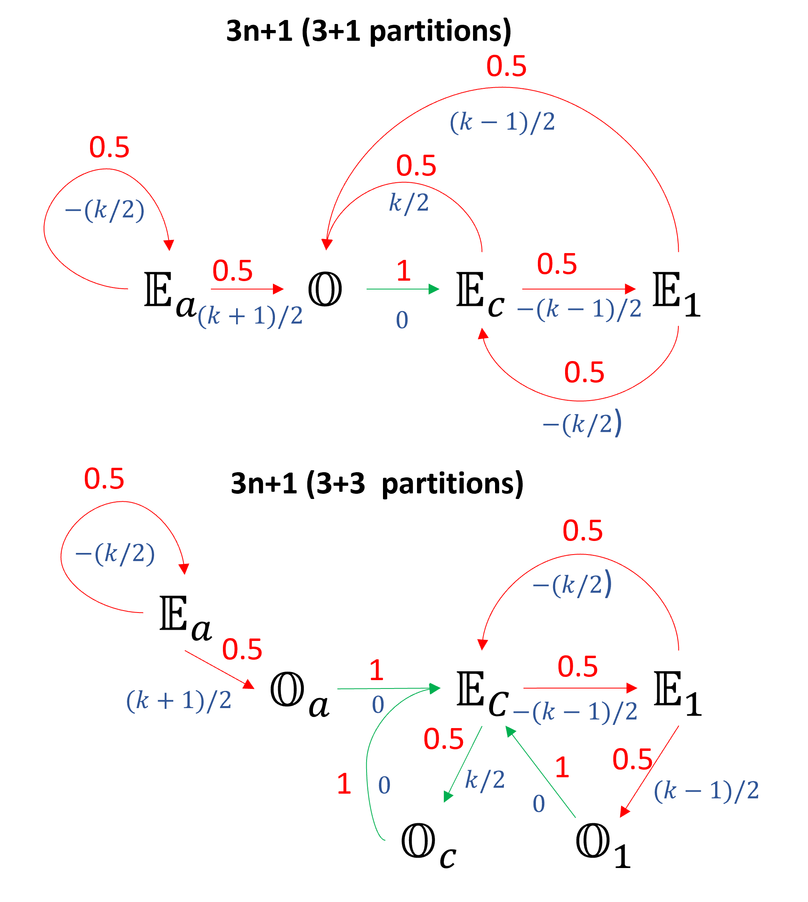

## Theorem: If a computer can compute up to $l$ Collatz operations, we can always pick a number that is guaranteed to exceed $l$ operations without reaching to 1 and not getting into a cycle.

(Not sure if this has been shown elsewhere, but for a computational person like me, this seems relevant.)

## Collatz-Conjecture Problem Statement
From [wiki](https://en.wikipedia.org/wiki/Collatz_conjecture)

Consider the following operation on an arbitrary positive integer:

- If the number is even, divide it by two.
- If the number is odd, triple it and add one.

In modular arithmetic notation, define the function $f$ as follows:

$$
f(n) =
\begin{cases}
n/2 & \textrm{if} \, n \equiv 0 (\textrm{mod 2})\\
3n+1 & \textrm{if}\, n \equiv 1 (\textrm{mod 2})
\end{cases}
$$

Now form a sequence by performing this operation repeatedly, beginning with any positive integer, and taking the result at each step as the input at the next.

In notation:

$$
a_i =
\begin{cases}
n & {\text{for }} i=0, \\
f(a_{i-1}) & {\text{for }} i>0
\end{cases}
$$

(that is: $a_i$ is the value of $f$ applied to $n$ recursively $i$ times; $a_i = f^i(n))$.

The Collatz conjecture is: This process will eventually reach the number 1, regardless of which positive integer is chosen initially. That is, for each $n$, there is some $i$ with $a_i = 1$.

## Some property
1. $U(n):= an+1$ stretches the number line or equivalently $U(n) >n$, for odd $n$
2. $L(n):= n/2$ compresses the number line or equivalently $L(n) <n$ for even $n$
3. The only way to get out is to land on a $2^n\$

## Partitioning $\mathbb{N}$ into 3 Even partition and 1 Odd partition. Then divide the Odd partition into 3 sub partition.
The following method will generate four disjoint partitions that spans $\mathbb{N}$. Subscripts $c$ stands for Collatz and subscript $a$ is from $an+1$. As you will see these are special partitions. 

### 3 even + 1 odd
Partition $\mathbb{N}$ into four sets as follows:
1. $\mathbb{O} = \\{ o = 2k-1: k \in \mathbb{N} \\}$
2. $\mathbb{E_1} = \\{ 3o-1 = 6k-4: k \in \mathbb{N} \\}$
3. $\mathbb{E_c} = \\{ 3o+1 = 6k-2: k \in \mathbb{N} \\}$
4. $\mathbb{E_a} = \\{ 3o+3 = 6k: k \in \mathbb{N} \\}$ (Doesnt contain $2^n$)

## Sub-Partitioning $\mathbb{O}$ (3 even + 3 odd)
$\mathbb{O}$ can be divided into $3$ subpartitions based on $L(n)$ mapping as follows:

$\mathbb{O} = \mathbb{O_1} \cap \mathbb{O_a} \cap \mathbb{O_c}$

1. $\mathbb{O_1} = \\{6m-5: m \in \mathbb{N}\\}$
2. $\mathbb{O_a} = \\{6m-3: m \in \mathbb{N}\\}$
5. $\mathbb{O_c} = \\{6m-1: m \in \mathbb{N}\\}$

**Every natural number $n$ can be characterized by the number $k$ and the partition.**   
For eg: in $3n+1$, Natural number $1 = (1, \mathbb{O_c})$, $12 = (2, \mathbb{E_a})$ and $16 = (3, \mathbb{E_c})$.

## Property of the Partitions for $3n+1$ (proof in appendix)

**1. $U:\mathbb{O} \rightarrow \mathbb{E_c}$ for all $k$** 

**2a. $L:\mathbb{E_1} \rightarrow \mathbb{O_1}$ for odd $k$**   
**2b. $L:\mathbb{E_1} \rightarrow \mathbb{E_c}$ for even $k$**  
 
**3a. $L:\mathbb{E_c} \rightarrow \mathbb{E_1}$ for odd $k$**   
**3b. $L:\mathbb{E_c} \rightarrow \mathbb{O_c}$ for even $k$**  

**4a. $L:\mathbb{E_a} \rightarrow \mathbb{O_a}$ for odd $k$**   
**4b. $L:\mathbb{E_a} \rightarrow \mathbb{E_a}$ for even $k$**  

### Transition Rule for $3n+1$  
**1. $\Delta k [\mathbb{O} \rightarrow \mathbb{E_c}] = 0$ for all $k$ | $k_{i+1}=k_i$**  

**2a. $\Delta k [\mathbb{E_1} \rightarrow \mathbb{O_1}] = (k-1)/2$ for odd $k$ | $k_{i+1}=(3k_i-1)/2$**   
**2b. $\Delta k [\mathbb{E_1} \rightarrow \mathbb{E_c}] = -(k/2)$ for even $k$ | $k_{i+1}=k_i/2$**  

**3a. $\Delta k [\mathbb{E_c} \rightarrow \mathbb{E_1}] = -(k-1)/2$ for odd $k$ | $k_{i+1}=(k_i+1)/2$**   
**3b. $\Delta k [\mathbb{E_c} \rightarrow \mathbb{O_c}] = (k/2)$ for even $k$ | $k_{i+1}=(3k_i/2)$**  

**4a. $\Delta k [\mathbb{E_a} \rightarrow \mathbb{O_a}] = (k+1)/2$ for odd $k$ | $k_{i+1}=(3k_i+1)/2$**   
**5b. $\Delta k [\mathbb{E_a} \rightarrow \mathbb{E_a}] = -(k/2)$ for even $k$ | $k_{i+1}=(k_i/2)$**  

**NOte:**
1. In this scheme, Operation $U(n) = 3n+1$, on $\mathbb{O}$, leaves $k$ unchanged.
2. The transition from any Even set to $\mathbb{O}$ increases $k$.
2. The transition from any Even set to another Even set decreases $k$.

## Transition Graph
  

- Probability of transition is given in red and $\Delta k$ is given in blue.
- $\Delta k$ must be integer which clarifies the parity of $k$. 
- Red arrow halves the value of number and green arrows increases the value of number by $3n+1$.
- However, note that in this scheme, the transition from Odd partition to $\mathbb{E_c}$ leaves the index $k$ unchanged and transition from Even to Odd partition increases the value of index $k$.
 
**Some Observations**  
**1. If there exist a cycle, A cycle will not contain any elements from partitions $\mathbb{E_a}$ and $\mathbb{O_a}$.** 
- Implication: When searching for a cycle, look elsewhere.

Seems like the following are related statements:  
**2a. Only the elements of partitions $\mathbb{E_c}$ can be landed from even and odd number.**  
**2b. If there exist a cycle an element from $\mathbb{E_c}$ must participate.**  
**2c. Every loop contains element from $\mathbb{E_c}$.**  

**3. Even partitions without $2^n$ can't form a loop with or connect to partitions with $2^p$**

## Main Theorem
**If a computer can compute upto $l$ collatz operations, we can always pick a number that will exceed $l$ operations without reaching to 1 not getting into a cycle**

If $l$ is even, pick the following number,

$$ 
n = (k=2^{l/2}, \mathbb{O_c})
$$ 

If $l$ is odd, pick the following number,

$$ 
n = (k=2^{(l+1)/2}, \mathbb{O_c})
$$ 

Let's, denote the positive integer exponent by $q$ and index with operation count as a subscript.

Then, 

$$
n_0 = (k_0 = 2^q, \mathbb{O_c})
$$

Note that $k_0 \equiv 0$ (mod 2) and thus is even.

$\mathbb{O_c}$ will always transition to $\mathbb{E_c}$ with no change in $k$ because of the transition rule:

$$
\Delta k \[\mathbb{O_c} \rightarrow \mathbb{E_c}\] = 0 \quad \text{for any} \quad k
$$

Therefore, after 1 operation,

$$
k_1 \leftarrow k_0 = 2^q
$$

and 

$$
n_1 = (k_1=2^q, \mathbb{E_c})
$$

Because $k_1 = 2^q \equiv 0$ (mod 2) and thus is even, $\mathbb{E_c}$ will transition to $\mathbb{O_c}$. The change in $k$ is given by the transition rule: 

$$
\Delta k \[\mathbb{E_c} \rightarrow \mathbb{O_c}\] = (k/2) \quad \text{for even} \quad k
$$

After 2 operations $k$ becomes:

$$
k_2 \leftarrow (3k_1/2) = 3^1 \cdot 2^{q-1}
$$

and,

$$
n_2 = (k_2=3^1 \cdot 2^{q-1}, \mathbb{O_c})
$$

Transition $\mathbb{O_c} \rightarrow \mathbb{E_c} \rightarrow \mathbb{O_c}$ repeats as long as $k$ is even. 

$k$ remains divisible by 2 until $2q$ operations after which $k$ becomes.

$$
k_{2q} \leftarrow (3k_{2q-1}/2) = 3^{2q} \times 2^{q-q} = 3^{2q} 
$$

and 

$$
n_{2q} = (3^{2q}, \mathbb{E_c})
$$

Note that n = 1 in its partitional form is equal to $(1, \mathbb{O_1}) \neq (3^{2q}, \mathbb{E_c})$.

Operation $\mathbb{O_c} \rightarrow \mathbb{E_c}$ only increases the value of $k$ thus it cannot form a cycle.

Proved.

## Appendix

## Property of the Partitions for 3n+1

**Theorem 1**  
**$U:\mathbb{O} \rightarrow \mathbb{E_c}$ for all $k$** (By construction)

**Theorem 2**  
 a. **$L:\mathbb{E_1} \rightarrow \mathbb{O_1}$ for odd $k$**   
 b. **$L:\mathbb{E_1} \rightarrow \mathbb{E_c}$ for even $k$**  

2a. for odd $k$, $k = 2m-1$ for $m \in \mathbb{N}$.  
This means, $L(6k-4) = L(12m-10) = (12m-10)/2 = 6m-5 \in \mathbb{O_1}$.  

2b. for even $k$, $k = 2m$ for $m \in \mathbb{N}$.  
This means, $L(6k-4) = L(12m-4) = (12m-4)/2 = 6m-2 \in \mathbb{E_c}$.

**Theorem 3**  
 a. **$L:\mathbb{E_c} \rightarrow \mathbb{E_1}$ for odd $k$**   
 b. **$L:\mathbb{E_c} \rightarrow \mathbb{O_c}$ for even $k$**  

3a. for odd $k$, $k = 2m-1$ for $m \in \mathbb{N}$.  
This means, $L(6k-2) = L(12m-4) = (12m-4)/2 = 6m-2 \in \mathbb{E_1}$.  

3b. for even $k$, $k = 2m$ for $m \in \mathbb{N}$.  
This means, $L(6k-2) = L(12m-2) = (12m-2)/2 = 6m-1 \in \mathbb{O_c}$.  

**Theorem 4**  
 a. **$L:\mathbb{E_a} \rightarrow \mathbb{O_a}$ for odd $k$**   
 b. **$L:\mathbb{E_a} \rightarrow \mathbb{E_a}$ for even $k$**  

Proof: $L(6k) = 3k$ 

2a. for odd $k$, $k = 2m-1$ for $m \in \mathbb{N}$.  
This means, $L(6k) = L(12m-6) = (12m-6)/2 = 6m-3 \in \mathbb{O_a}$.  

2b. for even $k$, $k = 2m$ for $m \in \mathbb{N}$.  
This means, $L(6k) = L(12m) = 12m/2 = 6m \in \mathbb{E_a}$.

## (3 + 1) Partition Table
|	$k$	|	$\mathbb{O}:=\\{o=2k-1\\}$	|	$\mathbb{E_1}=\\{3o-1 = 6k-4\\}$	|	$\mathbb{E_c}=\\{3o+1 = 6k-2\\}$	|	$\mathbb{E_a}=\\{3o+3 = 6k\\}$	|
|	---	|	---	|---		|	---	|	---	|
|	1	|	1	|	2	|	4	|	6	|
|	2	|	3	|	8	|	10	|	12	|
|	3	|	5	|	14	|	16	|	18	|
|	4	|	7	|	20	|	22	|	24	|
|	5	|	9	|	26	|	28	|	30	|
|	6	|	11	|	32	|	34	|	36	|
|	7	|	13	|	38	|	40	|	42	|
|	8	|	15	|	44	|	46	|	48	|
|	9	|	17	|	50	|	52	|	54	|
|	10	|	19	|	56	|	58	|	60	|
|	11	|	21	|	62	|	64	|	66	|
|	12	|	23	|	68	|	70	|	72	|
|	13	|	25	|	74	|	76	|	78	|
|	14	|	27	|	80	|	82	|	84	|
|	15	|	29	|	86	|	88	|	90	|
|	16	|	31	|	92	|	94	|	96	|
|	17	|	33	|	98	|	100	|	102	|
|	18	|	35	|	104	|	106	|	108	|
|	19	|	37	|	110	|	112	|	114	|
|	20	|	39	|	116	|	118	|	120	|
|	21	|	41	|	122	|	124	|	126	|
|	22	|	43	|	128	|	130	|	132	|
|	23	|	45	|	134	|	136	|	138	|
|	24	|	47	|	140	|	142	|	144	|
|	25	|	49	|	146	|	148	|	150	|

## Sub Partition Table
|	$\mathbb{O_1}:=\\{6m-5\\}$	|	$\mathbb{O_a}:=\\{6m-3\\}$	|	$\mathbb{O_c}:=\\{6m-1\\}$	|
|	---	|---	| ---	|
|	1	|	3	|	5	|
|	7	|	9	|	11	|
|	13	|	15	|	17	|
|	19	|	21	|	23	|
|	25	|	27	|	29	|
|	31	|	33	|	35	|
|	37	|	39	|	41	|
|	43	|	45	|	47	|
|	49	|	51	|	53	|
|	55	|	57	|	59	|

