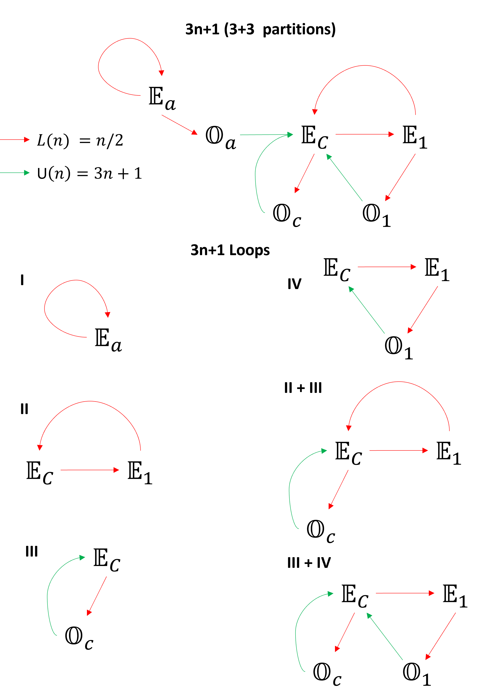

# Theorem: There exist only one cycle in 3n+1 Collatz (in progress)

Naming the raising operation as $U$ and lowering operation as $L$.

$$
U(n):= an+1
$$

$$
L(n):= n/2
$$

Consider a series of operations $S$ on number $n$, consisting of $l$ number of $L$ operations and $u$ number of $U$ operations, in any order. Collatz operations are linear and the operation will result in,

$$
S(n) = \frac{a^u \cdot n + b}{2^l}
$$

where $b$ is a number that depends on $l$, $u$, and $n$.

For a cycle, 
1. $S$ needs to come from a loop in the partition graph (see below)
2. $S$ cannot contain only one type of operation.
3. $S$ must contain more than two operations, since $a>2$.
4. $S(n) = n$,

$$
\frac{a^u \cdot n + b}{2^l} = n
$$

or,

$$
n = \frac{b}{2^l - a^u} 
$$

For a cycle, $n$ must be a positive integer, for which, the following two condition must hold:
1. $2^l > a^u$
2. $b \equiv = (mod (2^l - a^u))$
3. $b > 0 $

Property of a cycle:
1. Invariant to the starting partition of the loop, i.e. irrespective of the starting number, the solution to $S(n) = n$ will result in a positive integer. In particular, it results in the starting number.

Now, we consider $3n+1$.

## Partitioning 3n+1
The following method will generate four disjoint partitions that spans $\mathbb{N}$. Subscripts $c$ stands for Collatz and subscript $a$ is from $an+1$. As you will see these are special partitions. 

### 3 even + 1 odd
Partition $\mathbb{N}$ into four sets as follows:
1. $\mathbb{O} = \\{ o = 2k-1: k \in \mathbb{N} \\}$
2. $\mathbb{E_1} = \\{ 3o-1 = 6k-4: k \in \mathbb{N} \\}$
3. $\mathbb{E_c} = \\{ 3o+1 = 6k-2: k \in \mathbb{N} \\}$
4. $\mathbb{E_a} = \\{ 3o+3 = 6k: k \in \mathbb{N} \\}$ (Doesnt contain $2^n$)

## Sub-Partitioning $\mathbb{O}$ (3 even + 3 odd)
$\mathbb{O}$ can be divided into $3$ subpartitions based on $L(n)$ mapping as follows:

$\mathbb{O} = \mathbb{O_1} \cap \mathbb{O_a} \cap \mathbb{O_c}$

1. $\mathbb{O_1} = \\{6m-5: m \in \mathbb{N}\\}$
2. $\mathbb{O_a} = \\{6m-3: m \in \mathbb{N}\\}$
5. $\mathbb{O_c} = \\{6m-1: m \in \mathbb{N}\\}$

## Property of the Partitions for $3n+1$ (proof in appendix)

**1. $U:\mathbb{O} \rightarrow \mathbb{E_c}$ for all $k$** 

**2a. $L:\mathbb{E_1} \rightarrow \mathbb{O_1}$ for odd $k$**   
**2b. $L:\mathbb{E_1} \rightarrow \mathbb{E_c}$ for even $k$**  
 
**3a. $L:\mathbb{E_c} \rightarrow \mathbb{E_1}$ for odd $k$**   
**3b. $L:\mathbb{E_c} \rightarrow \mathbb{O_c}$ for even $k$**  

**4a. $L:\mathbb{E_a} \rightarrow \mathbb{O_a}$ for odd $k$**   
**4b. $L:\mathbb{E_a} \rightarrow \mathbb{E_a}$ for even $k$**  

The details about partition method are given in the appendix.

## Partition Graph and loops of 3n+1
  

## Cycles in 3n+1
For 3n+1,

$$
n = \frac{b}{2^l - 3^u} 
$$

- Loops I and II has only $L$ operations and cannot result in cycles. Equivalently, $b=0$ for loop I and II.
- Loop III has only two operations and cannot result in cycle. Equivalently, $2^l < 3^u$.

**Loop IV**
1. Consider the permuation: $\mathbb{E_c} \rightarrow \mathbb{E_1} \rightarrow \mathbb{O_1} \rightarrow \mathbb{E_c}$
Here,

$$
S(n) = U \circ L \circ L(n) = 3\left(\frac{n}{2^2} \right) + 1 = \frac{3n + 2^2}{2^2}
$$

Thus, $b = 4$. We have $l=2$ and $u=1$, Therefore, $n = 4 \in \mathbb{E_c}$.

This means a cycle exist in loop IV. The remaining 2 permutations is guaranteed to yield positive integer but we test it anyway for completion.

2. Consider the permuation: $ \mathbb{E_1} \rightarrow \mathbb{O_1} \rightarrow \mathbb{E_c} \rightarrow \mathbb{E_1}$
Here,

$$
S(n) = L \circ U \circ L(n) = \frac{1}{2}\left(3\left(\frac{n}{2} \right) + 1\right) = \frac{3n + 2}{2^2}
$$

Thus, $b = 2$. We have $l=2$ and $u=1$, Therefore, $n = 2 \in \mathbb{E_1}$.

3. Consider the permuation: $\mathbb{O_1} \rightarrow \mathbb{E_c} \rightarrow \mathbb{E_1} \rightarrow \mathbb{O_1}$
Here,

$$
S(n) = L \circ L \circ U(n) = \frac(1/2)\frac(1.2)(3n+1) + 1 = \frac{3n + 1}{2^2}
$$

Thus, $b = 1$. We have $l=2$ and $u=1$, Therefore, $n = 1 \in \mathbb{O_1}$.

$1 \rightarrow 4 \rightarrow 1$ is the known cycle,

**What happens if we go around Loop IV twice?**

We can pick any permutation. If it's a cycle, we will get a positive integer solution to $n$.

Consider the permutation: $\mathbb{O_1} \rightarrow \mathbb{E_c} \rightarrow \mathbb{E_1} \rightarrow \mathbb{O_1}\rightarrow \mathbb{E_c} \rightarrow \mathbb{E_1} \rightarrow \mathbb{O_1}$

$$
S(n) = L \circ L \circ U \ circ L \circ L \circ U(n) = \frac{3^2 n + 3 + 2^2}{2^4}
$$

Thus, $b = 7$. Here, $l=4$, $u=2$, and $2^4 - 3^2 = 7$. Thus $n = 1 \in \mathbb{O_1}$. This is same as going around 1 time.

So, either only one cycle can exist per loop, or this method is not capable of giving all cycle. 

**Loop V** (this one is knotted)
1. Consider the following permutation: $\mathbb{O_C} \rightarrow \mathbb{E_C} \rightarrow \mathbb{E_1} \rightarrow \mathbb{E_C} \rightarrow \mathbb{O_C}$

$$
S(n) = L \circ L \circ L \circ U(n) = \frac{3n+1}{2^3}
$$

Thus, $b = 1$. Here, $l=3$, $u=1$, and $2^3 - 3^1 = 5$. Thus $n = 1/5$. A cycle dont exit.

2. Consider the following permutation: $\mathbb{E_C} \rightarrow \mathbb{O_C} \rightarrow \mathbb{E_C} \rightarrow \mathbb{E_1} \rightarrow \mathbb{E_C}$

$$
S(n) = L \circ L \circ U \circ L(n) = \frac{3n+2}{2^3}
$$

Thus, $b = 2$. Here, $l=3$, $u=1$, and $2^3 - 3^1 = 5$. Thus $n = 2/5$. A cycle dont exit.

**Let's loop around loop III twice before going to II**
$\mathbb{O_C} \rightarrow \mathbb{E_C} \rightarrow $\mathbb{O_C} \rightarrow \mathbb{E_C} \rightarrow \mathbb{E_1} \rightarrow \mathbb{E_C} \rightarrow \mathbb{O_C}$

$$
S(n) = L \circ L \circ L \circ U\circ L \circ U(n) = \frac{3n^2 + 3 + 2}{2^4}
$$

Thus, $b = 5$. Here, $l=4$, $u=2$, and $2^4 - 3^2 = 7$. Thus $n = 5/4$. A cycle dont exit.

Further looping around loop III, before going to II which result in 
1. $l=5$, $u=3$, $2^5 - 3^3 = 5$ (check this)
2. $l=6$, $u=4$, $2^6 - 3^4 = -17$ (after this 3^u > 2^l, yielding negative $n$)
3. $l=7$, $u=5$, $2^7 - 3^5 = -115$

# Loop IV

## One loop can only have cycle. (How do we prove this?) 

## Appendix

## Partitioning $\mathbb{N}$ into 3 Even partition and 1 Odd partition. Then divide the Odd partition into 3 sub partition.
The following method will generate four disjoint partitions that spans $\mathbb{N}$. Subscripts $c$ stands for Collatz and subscript $a$ is from $an+1$. As you will see these are special partitions. 

### 3 even + 1 odd
Partition $\mathbb{N}$ into four sets as follows:
1. $\mathbb{O} = \\{ o = 2k-1: k \in \mathbb{N} \\}$
2. $\mathbb{E_1} = \\{ 3o-1 = 6k-4: k \in \mathbb{N} \\}$
3. $\mathbb{E_c} = \\{ 3o+1 = 6k-2: k \in \mathbb{N} \\}$
4. $\mathbb{E_a} = \\{ 3o+3 = 6k: k \in \mathbb{N} \\}$ (Doesnt contain $2^n$)

## Sub-Partitioning $\mathbb{O}$ (3 even + 3 odd)
$\mathbb{O}$ can be divided into $3$ subpartitions based on $L(n)$ mapping as follows:

$\mathbb{O} = \mathbb{O_1} \cap \mathbb{O_a} \cap \mathbb{O_c}$

1. $\mathbb{O_1} = \\{6m-5: m \in \mathbb{N}\\}$
2. $\mathbb{O_a} = \\{6m-3: m \in \mathbb{N}\\}$
5. $\mathbb{O_c} = \\{6m-1: m \in \mathbb{N}\\}$

**Every natural number $n$ can be characterized by the number $k$ and the partition.**   
For eg: in $3n+1$, Natural number $1 = (1, \mathbb{O_c})$, $12 = (2, \mathbb{E_a})$ and $16 = (3, \mathbb{E_c})$.

## Property of the Partitions for $3n+1$ (proof in appendix)

**1. $U:\mathbb{O} \rightarrow \mathbb{E_c}$ for all $k$** 

**2a. $L:\mathbb{E_1} \rightarrow \mathbb{O_1}$ for odd $k$**   
**2b. $L:\mathbb{E_1} \rightarrow \mathbb{E_c}$ for even $k$**  
 
**3a. $L:\mathbb{E_c} \rightarrow \mathbb{E_1}$ for odd $k$**   
**3b. $L:\mathbb{E_c} \rightarrow \mathbb{O_c}$ for even $k$**  

**4a. $L:\mathbb{E_a} \rightarrow \mathbb{O_a}$ for odd $k$**   
**4b. $L:\mathbb{E_a} \rightarrow \mathbb{E_a}$ for even $k$**  

### Transition Rule for $3n+1$  
**1. $\Delta k [\mathbb{O} \rightarrow \mathbb{E_c}] = 0$ for all $k$ | $k_{i+1}=k_i$**  

**2a. $\Delta k [\mathbb{E_1} \rightarrow \mathbb{O_1}] = (k-1)/2$ for odd $k$ | $k_{i+1}=(3k_i-1)/2$**   
**2b. $\Delta k [\mathbb{E_1} \rightarrow \mathbb{E_c}] = -(k/2)$ for even $k$ | $k_{i+1}=k_i/2$**  

**3a. $\Delta k [\mathbb{E_c} \rightarrow \mathbb{E_1}] = -(k-1)/2$ for odd $k$ | $k_{i+1}=(k_i+1)/2$**   
**3b. $\Delta k [\mathbb{E_c} \rightarrow \mathbb{O_c}] = (k/2)$ for even $k$ | $k_{i+1}=(3k_i/2)$**  

**4a. $\Delta k [\mathbb{E_a} \rightarrow \mathbb{O_a}] = (k+1)/2$ for odd $k$ | $k_{i+1}=(3k_i+1)/2$**   
**5b. $\Delta k [\mathbb{E_a} \rightarrow \mathbb{E_a}] = -(k/2)$ for even $k$ | $k_{i+1}=(k_i/2)$**  

**NOte:**
1. In this scheme, Operation $U(n) = 3n+1$, on $\mathbb{O}$, leaves $k$ unchanged.
2. The transition from any Even set to $\mathbb{O}$ increases $k$.
2. The transition from any Even set to another Even set decreases $k$.

## Transition Graph
  

- Probability of transition is given in red and $\Delta k$ is given in blue.
- $\Delta k$ must be integer which clarifies the parity of $k$. 
- Red arrow halves the value of number and green arrows increases the value of number by $3n+1$.
- However, note that in this scheme, the transition from Odd partition to $\mathbb{E_c}$ leaves the index $k$ unchanged and transition from Even to Odd partition increases the value of index $k$.
 
**Some Observations**  
**1. If there exist a cycle, A cycle will not contain any elements from partitions $\mathbb{E_a}$ and $\mathbb{O_a}$.** 
- Implication: When searching for a cycle, look elsewhere.

Seems like the following are related statements:  
**2a. Only the elements of partitions $\mathbb{E_c}$ can be landed from even and odd number.**  
**2b. If there exist a cycle an element from $\mathbb{E_c}$ must participate.**  
**2c. Every loop contains element from $\mathbb{E_c}$.**  

**3. Even partitions without $2^n$ can't form a loop with or connect to partitions with $2^p$**

## Property of the Partitions for 3n+1

**Theorem 1**  
**$U:\mathbb{O} \rightarrow \mathbb{E_c}$ for all $k$** (By construction)

**Theorem 2**  
 a. **$L:\mathbb{E_1} \rightarrow \mathbb{O_1}$ for odd $k$**   
 b. **$L:\mathbb{E_1} \rightarrow \mathbb{E_c}$ for even $k$**  

2a. for odd $k$, $k = 2m-1$ for $m \in \mathbb{N}$.  
This means, $L(6k-4) = L(12m-10) = (12m-10)/2 = 6m-5 \in \mathbb{O_1}$.  

2b. for even $k$, $k = 2m$ for $m \in \mathbb{N}$.  
This means, $L(6k-4) = L(12m-4) = (12m-4)/2 = 6m-2 \in \mathbb{E_c}$.

**Theorem 3**  
 a. **$L:\mathbb{E_c} \rightarrow \mathbb{E_1}$ for odd $k$**   
 b. **$L:\mathbb{E_c} \rightarrow \mathbb{O_c}$ for even $k$**  

3a. for odd $k$, $k = 2m-1$ for $m \in \mathbb{N}$.  
This means, $L(6k-2) = L(12m-4) = (12m-4)/2 = 6m-2 \in \mathbb{E_1}$.  

3b. for even $k$, $k = 2m$ for $m \in \mathbb{N}$.  
This means, $L(6k-2) = L(12m-2) = (12m-2)/2 = 6m-1 \in \mathbb{O_c}$.  

**Theorem 4**  
 a. **$L:\mathbb{E_a} \rightarrow \mathbb{O_a}$ for odd $k$**   
 b. **$L:\mathbb{E_a} \rightarrow \mathbb{E_a}$ for even $k$**  

Proof: $L(6k) = 3k$ 

2a. for odd $k$, $k = 2m-1$ for $m \in \mathbb{N}$.  
This means, $L(6k) = L(12m-6) = (12m-6)/2 = 6m-3 \in \mathbb{O_a}$.  

2b. for even $k$, $k = 2m$ for $m \in \mathbb{N}$.  
This means, $L(6k) = L(12m) = 12m/2 = 6m \in \mathbb{E_a}$.

## (3 + 1) Partition Table
|	$k$	|	$\mathbb{O}:=\\{o=2k-1\\}$	|	$\mathbb{E_1}=\\{3o-1 = 6k-4\\}$	|	$\mathbb{E_c}=\\{3o+1 = 6k-2\\}$	|	$\mathbb{E_a}=\\{3o+3 = 6k\\}$	|
|	---	|	---	|---		|	---	|	---	|
|	1	|	1	|	2	|	4	|	6	|
|	2	|	3	|	8	|	10	|	12	|
|	3	|	5	|	14	|	16	|	18	|
|	4	|	7	|	20	|	22	|	24	|
|	5	|	9	|	26	|	28	|	30	|
|	6	|	11	|	32	|	34	|	36	|
|	7	|	13	|	38	|	40	|	42	|
|	8	|	15	|	44	|	46	|	48	|
|	9	|	17	|	50	|	52	|	54	|
|	10	|	19	|	56	|	58	|	60	|
|	11	|	21	|	62	|	64	|	66	|
|	12	|	23	|	68	|	70	|	72	|
|	13	|	25	|	74	|	76	|	78	|
|	14	|	27	|	80	|	82	|	84	|
|	15	|	29	|	86	|	88	|	90	|
|	16	|	31	|	92	|	94	|	96	|
|	17	|	33	|	98	|	100	|	102	|
|	18	|	35	|	104	|	106	|	108	|
|	19	|	37	|	110	|	112	|	114	|
|	20	|	39	|	116	|	118	|	120	|
|	21	|	41	|	122	|	124	|	126	|
|	22	|	43	|	128	|	130	|	132	|
|	23	|	45	|	134	|	136	|	138	|
|	24	|	47	|	140	|	142	|	144	|
|	25	|	49	|	146	|	148	|	150	|

## Sub Partition Table
|	$\mathbb{O_1}:=\\{6m-5\\}$	|	$\mathbb{O_a}:=\\{6m-3\\}$	|	$\mathbb{O_c}:=\\{6m-1\\}$	|
|	---	|---	| ---	|
|	1	|	3	|	5	|
|	7	|	9	|	11	|
|	13	|	15	|	17	|
|	19	|	21	|	23	|
|	25	|	27	|	29	|
|	31	|	33	|	35	|
|	37	|	39	|	41	|
|	43	|	45	|	47	|
|	49	|	51	|	53	|
|	55	|	57	|	59	|

