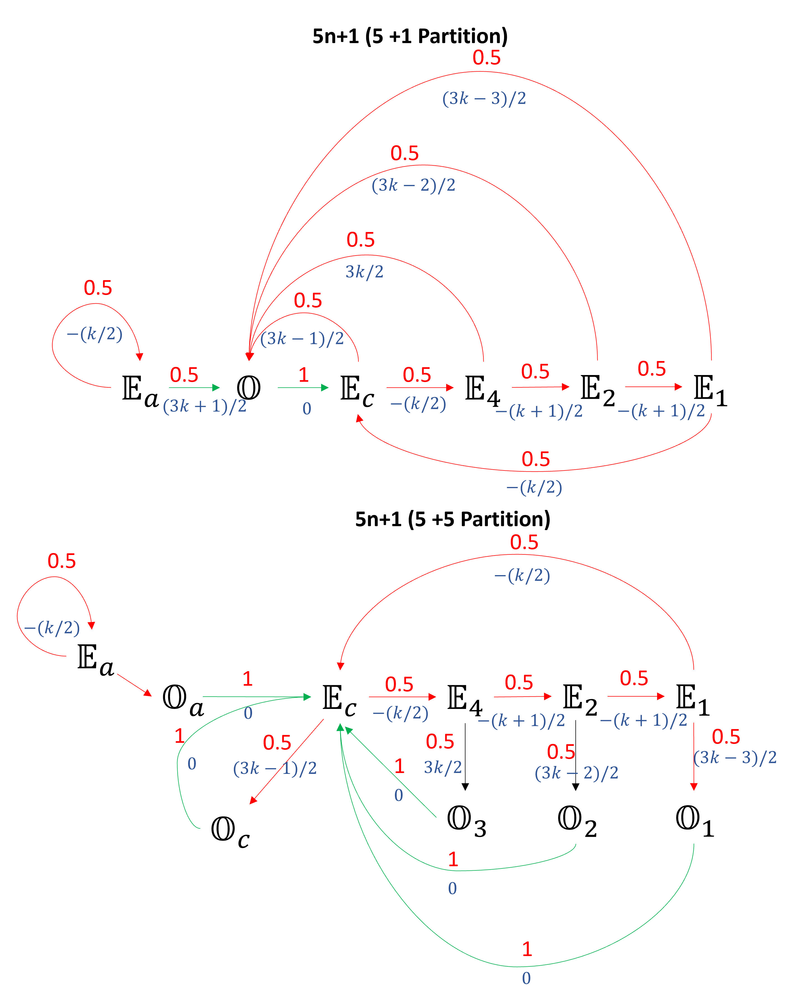
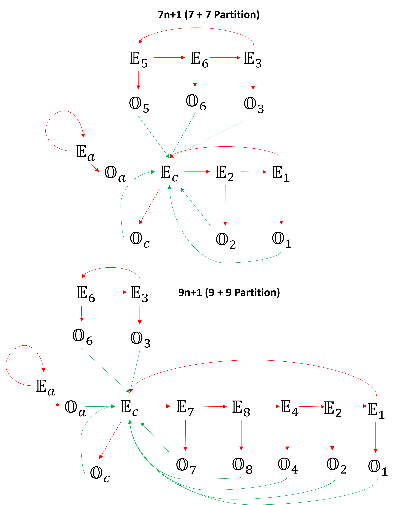

# Visualization of Collatz-Conjecture through Partitioning

## Transition Graph for $3n +1$ and $5n+1$



## Transition Graph for $7n+1$ and $9n+1$


## Problem Statement
From [wiki](https://en.wikipedia.org/wiki/Collatz_conjecture)

Consider the following operation on an arbitrary positive integer:

- If the number is even, divide it by two.
- If the number is odd, triple it and add one.

In modular arithmetic notation, define the function $f$ as follows:

$$
f(n) =
\begin{cases}
n/2 & \textrm{if} \, n \equiv 0 (\textrm{mod 2})\\
3n+1 & \textrm{if}\, n \equiv 1 (\textrm{mod 2})
\end{cases}
$$

Now form a sequence by performing this operation repeatedly, beginning with any positive integer, and taking the result at each step as the input at the next.

In notation:

$$
a_i =
\begin{cases}
n & {\text{for }} i=0, \\
f(a_{i-1}) & {\text{for }} i>0
\end{cases}
$$

(that is: $a_i$ is the value of $f$ applied to $n$ recursively $i$ times; $a_i = f^i(n))$.

The Collatz conjecture is: This process will eventually reach the number 1, regardless of which positive integer is chosen initially. That is, for each $n$, there is some $i$ with $a_i = 1$.


## Some property
1. $U(n):= an+1$ stretches the number line or equivalently $U(n) >n$, for odd $n$
2. $L(n):= n/2$ compresses the number line or equivalently $L(n) <n$ for even $n$
3. The only way to get out is to land on a $2^n\$

## Partitioning Even set into $a$ partitions
The following method will generate disjoint partitions that spans $\mathbb{N}$ and the relation between index $k$ and odd number $o$ remains the same for all $an+1$ partitions. This partitioning system helps in comparing the transitions. Subscripts $c$ stands for collatz and subscript $a$ from $an+1$. As you will see these are special partitions. 

### $3n+1$ (3 even + 1 odd)
Partition $\mathbb{N}$ into four sets as follows:
1. $\mathbb{O} = \\{ o = 2k-1: k \in \mathbb{N} \\}$
2. $\mathbb{E_1} = \\{ 3o-1 = 6k-4: k \in \mathbb{N} \\}$
3. $\mathbb{E_c} = \\{ 3o+1 = 6k-2: k \in \mathbb{N} \\}$
4. $\mathbb{E_a} = \\{ 3o+3 = 6k: k \in \mathbb{N} \\}$ (Doesnt contain $2^n$)

### $5n+1$ (5 even + 1 odd)
Partition $\mathbb{N}$ into four sets as follows:
1. $\mathbb{O} = \\{ o = 2k-1: k \in \mathbb{N} \\}$
2. $\mathbb{E_1} = \\{ 5o-3 = 10k-8: k \in \mathbb{N} \\}$
3. $\mathbb{E_2} = \\{ 5o-1 = 10k-6: k \in \mathbb{N} \\}$
4. $\mathbb{E_c} = \\{ 5o+1 = 10k-4: k \in \mathbb{N} \\}$
3. $\mathbb{E_4} = \\{ 5o+3 = 10k-2: k \in \mathbb{N} \\}$
4. $\mathbb{E_a} = \\{ 5o+5 = 10k: k \in \mathbb{N} \\}$ (Doesnt contain $2^n$)

### $7n + 1$ (7 even + 1 odd)
1. $\mathbb{O} = \\{ o = 2k-1: k \in \mathbb{N} \\}$
2. $\mathbb{E_1} = \\{ 7o-5 = 14k-12: k \in \mathbb{N} \\}$
3. $\mathbb{E_2} = \\{ 7o-3 = 14k-10: k \in \mathbb{N} \\}$
4. $\mathbb{E_3} = \\{ 7o-1 = 14k-8: k \in \mathbb{N} \\}$ (Doesn't contain $2^n$, $2^n$ (mod7) results in $\\{1,2,4...\\}$, $-4 \equiv 3$ (mod7))
5. $\mathbb{E_c} = \\{ 7o+1 = 14k-6: k \in \mathbb{N} \\}$
6. $\mathbb{E_5} = \\{ 7o+3 = 14k-4: k \in \mathbb{N} \\}$ (Doesnt contain $2^n$, $2^n$ (mod7) results in $\\{1,2,4...\\}$, $-2 \equiv 5$ (mod7))
7. $\mathbb{E_6} = \\{ 7o+5 = 14k-2: k \in \mathbb{N} \\}$ (Doesnt contain $2^n$, $2^n$ (mod7) results in $\\{1,2,4...\\}$, $-1\equiv 6$ (mod7))
8. $\mathbb{E_a} = \\{ 7o+7 = 14k: k \in \mathbb{N} \\}$ (Doesnt contain $2^n$)

### $9n + 1$ (9 even + 1 odd)
1. $\mathbb{O} = \\{ o = 2k-1: k \in \mathbb{N} \\}$
2. $\mathbb{E_1} = \\{ 9o-7 = 18k-16: k \in \mathbb{N} \\}$
3. $\mathbb{E_2} = \\{ 9o-5 = 18k-14: k \in \mathbb{N} \\}$
4. $\mathbb{E_3} = \\{ 9o-3 = 18k-12: k \in \mathbb{N} \\}$ (This is of the form $3(6k-4)$, Therefore, cannot contain $2^n$)  
5. $\mathbb{E_4} = \\{ 9o-1 = 18k-10: k \in \mathbb{N} \\}$ 
6. $\mathbb{E_c} = \\{ 9o+1 = 18k-8: k \in \mathbb{N} \\}$
7. $\mathbb{E_6} = \\{ 9o+3 = 18k-6: k \in \mathbb{N} \\}$ (This is of the form $3(6k-2)$, Therefore, cannot contain $2^n$)  
8. $\mathbb{E_7} = \\{ 9o+5 = 18k-4: k \in \mathbb{N} \\}$
9. $\mathbb{E_8} = \\{ 9o+7 = 18k-2: k \in \mathbb{N} \\}$
10. $\mathbb{E_a} = \\{ 9o+9 = 18k: k \in \mathbb{N} \\}$ (Doesn't contain $2^n$)

**Every number can be characterized by the number $k$ and the partition.**   
For eg: in $3n+1$, Natural number $12 = (2, \mathbb{E_a})$ and $16 = (3, \mathbb{E_c})$, while in $5n+1$, $12 = (2, \mathbb{E_1})$ and $16 = (2, \mathbb{E_c})$.

## Sub-Partitioning $\mathbb{O}$ 
Furthermore $\mathbb{O}$ can be partitioned into $a$ subpartitions based on $L(n)$ mapping.

### for 3n+1 (3 even + 3 odd)
$\mathbb{O} = \mathbb{O_1} \cap \mathbb{O_a} \cap \mathbb{O_c}$  
$\mathbb{O_1} = \\{6m-5: m \in \mathbb{N}\\}$  
$\mathbb{O_a} = \\{6m-3: m \in \mathbb{N}\\}$  
$\mathbb{O_c} = \\{6m-1: m \in \mathbb{N}\\}$  

### for 5n+1 (5 even + 5 odd)
$\mathbb{O}$ = $\\{\mathbb{O_1}, \mathbb{O_c}, \mathbb{O_a}, \mathbb{O_2}, \mathbb{O_4}\\}$

**Thoughts: May be there is another indexing schema that can make this into a proper partitioning?**

## Table with the partition for $3n+1$ and $5n+1$

|	k	|	O:={o=2k-1}	|	$\mathbb{E_1}$={3o-1 = 6k-4}	|	$\mathbb{E_c}$={3o+1 = 6k-2}	|	$\mathbb{E_a}$={3o+3 = 6k}	|		|	k	|	O:={o=2k-1}	|	$\mathbb{E_1}$={5o-3 = 10k-8}	|	$\mathbb{E_2}$={5o-1 = 10k-6}	|	$\mathbb{E_c}$={5o+1 = 10k-4}	|	$\mathbb{E_4}$={5o+3 = 10k-2}	|	$\mathbb{E_a}$={5o+5 = 10k}	|
|	---	|	---	|----|---|---|---|----|----|----|----|----|----|----|
|	1	|	1	|	2	|	4	|	6	|		|	1	|	1	|	2	|	4	|	6	|	8	|	10	|
|	2	|	3	|	8	|	10	|	12	|		|	2	|	3	|	12	|	14	|	16	|	18	|	20	|
|	3	|	5	|	14	|	16	|	18	|		|	3	|	5	|	22	|	24	|	26	|	28	|	30	|
|	4	|	7	|	20	|	22	|	24	|		|	4	|	7	|	32	|	34	|	36	|	38	|	40	|
|	5	|	9	|	26	|	28	|	30	|		|	5	|	9	|	42	|	44	|	46	|	48	|	50	|
|	6	|	11	|	32	|	34	|	36	|		|	6	|	11	|	52	|	54	|	56	|	58	|	60	|
|	7	|	13	|	38	|	40	|	42	|		|	7	|	13	|	62	|	64	|	66	|	68	|	70	|
|	8	|	15	|	44	|	46	|	48	|		|	8	|	15	|	72	|	74	|	76	|	78	|	80	|
|	9	|	17	|	50	|	52	|	54	|		|	9	|	17	|	82	|	84	|	86	|	88	|	90	|
|	10	|	19	|	56	|	58	|	60	|		|	10	|	19	|	92	|	94	|	96	|	98	|	100	|
|	11	|	21	|	62	|	64	|	66	|		|	11	|	21	|	102	|	104	|	106	|	108	|	110	|
|	12	|	23	|	68	|	70	|	72	|		|	12	|	23	|	112	|	114	|	116	|	118	|	120	|
|	13	|	25	|	74	|	76	|	78	|		|	13	|	25	|	122	|	124	|	126	|	128	|	130	|
|	14	|	27	|	80	|	82	|	84	|		|	14	|	27	|	132	|	134	|	136	|	138	|	140	|
|	15	|	29	|	86	|	88	|	90	|		|	15	|	29	|	142	|	144	|	146	|	148	|	150	|

## Table with the subpartition of Odd Set for $3n+1$ and $5n+1$
|	$\mathbb{O_1}$	|	$\mathbb{O_a}$	|	$\mathbb{O_c}$	|		|	$\mathbb{O_1}$	|	$\mathbb{O_c}$	|	$\mathbb{O_a}$	|	$\mathbb{O_2}$	|	$\mathbb{O_4}$	|
|	---	|	---	|---	|---	|---	|---	|---	|---	|---|
|	1	|	3	|	5	|		|	1	|	3	|	5	|	7	|	9	|
|	7	|	9	|	11	|		|	11	|	13	|	15	|	17	|	19	|
|	13	|	15	|	17	|		|	21	|	23	|	25	|	27	|	29	|
|	19	|	21	|	23	|		|	31	|	33	|	35	|	37	|	39	|
|	25	|	27	|	29	|		|	41	|	43	|	45	|	47	|	49	|
|	31	|	33	|	35	|		|	51	|	53	|	55	|	57	|	59	|
|	37	|	39	|	41	|		|	61	|	63	|	65	|	67	|	69	|
|	43	|	45	|	47	|		|	71	|	73	|	75	|	77	|	79	|
|	49	|	51	|	53	|		|	81	|	83	|	85	|	87	|	89	|
|	55	|	57	|	59	|		|	91	|	93	|	95	|	97	|	99	|

### Table for $7n+1$

|	$k$	|	$\mathbb{O}$	|	$\mathbb{E_1}$	|	$\mathbb{E_2}$	|	$\mathbb{E_3}$	|	$\mathbb{E_c}$	|	$\mathbb{E_5}$	|	$\mathbb{E_6}$	|	$\mathbb{E_a}$	|
|	---	|	---	|---		|---		|	---	|	---	|---		|	---	|	---	|
|	1	|	1	|	2	|	4	|	6	|	8	|	10	|	12	|	14	|
|	2	|	3	|	16	|	18	|	20	|	22	|	24	|	26	|	28	|
|	3	|	5	|	30	|	32	|	34	|	36	|	38	|	40	|	42	|
|	4	|	7	|	44	|	46	|	48	|	50	|	52	|	54	|	56	|
|	5	|	9	|	58	|	60	|	62	|	64	|	66	|	68	|	70	|
|	6	|	11	|	72	|	74	|	76	|	78	|	80	|	82	|	84	|
|	7	|	13	|	86	|	88	|	90	|	92	|	94	|	96	|	98	|
|	8	|	15	|	100	|	102	|	104	|	106	|	108	|	110	|	112	|
|	9	|	17	|	114	|	116	|	118	|	120	|	122	|	124	|	126	|
|	10	|	19	|	128	|	130	|	132	|	134	|	136	|	138	|	140	|
|	11	|	21	|	142	|	144	|	146	|	148	|	150	|	152	|	154	|
|	12	|	23	|	156	|	158	|	160	|	162	|	164	|	166	|	168	|
|	13	|	25	|	170	|	172	|	174	|	176	|	178	|	180	|	182	|
|	14	|	27	|	184	|	186	|	188	|	190	|	192	|	194	|	196	|
|	15	|	29	|	198	|	200	|	202	|	204	|	206	|	208	|	210	|

|	$\mathbb{O_1}$	|	$\mathbb{O_3}$	|	$\mathbb{O_5}$	|	$\mathbb{O_a}$	|	$\mathbb{O_2}$	|	$\mathbb{O_c}$	|	$\mathbb{O_6}$	|
|	---	|	---	|---		|	---	|	---	|	---	|	---	|
|	1	|	3	|	5	|	7	|	9	|	11	|	13	|
|	15	|	17	|	19	|	21	|	23	|	25	|	27	|
|	29	|	31	|	33	|	35	|	37	|	39	|	41	|
|	43	|	45	|	47	|	49	|	51	|	53	|	55	|
|	57	|	59	|	61	|	63	|	65	|	67	|	69	|
|	71	|	73	|	75	|	77	|	79	|	81	|	83	|
|	85	|	87	|	89	|	91	|	93	|	95	|	97	|
|	99	|	101	|	103	|	105	|	107	|	109	|	111	|
|	113	|	115	|	117	|	119	|	121	|	123	|	125	|
 
### Table for $9n+1$ 

Note: 9 is not a prime, and may behave differently.

|	$k$	|	$\mathbb{O}$	|	$\mathbb{E_1}$	|	$\mathbb{E_2}$	|	$\mathbb{E_3}$	|	$\mathbb{E_4}$	|	$\mathbb{E_c}$	|	$\mathbb{E_6}$	|	$\mathbb{E_7}$	|	$\mathbb{E_8}$	|	$\mathbb{E_a}$	|
|	---	|---		|	---	|---		|	---	|	---	|---		|---		|	---	|	---	|---		|
|	1	|	1	|	2	|	4	|	6	|	8	|	10	|	12	|	14	|	16	|	18	|
|	2	|	3	|	20	|	22	|	24	|	26	|	28	|	30	|	32	|	34	|	36	|
|	3	|	5	|	38	|	40	|	42	|	44	|	46	|	48	|	50	|	52	|	54	|
|	4	|	7	|	56	|	58	|	60	|	62	|	64	|	66	|	68	|	70	|	72	|
|	5	|	9	|	74	|	76	|	78	|	80	|	82	|	84	|	86	|	88	|	90	|
|	6	|	11	|	92	|	94	|	96	|	98	|	100	|	102	|	104	|	106	|	108	|
|	7	|	13	|	110	|	112	|	114	|	116	|	118	|	120	|	122	|	124	|	126	|
|	8	|	15	|	128	|	130	|	132	|	134	|	136	|	138	|	140	|	142	|	144	|
|	9	|	17	|	146	|	148	|	150	|	152	|	154	|	156	|	158	|	160	|	162	|
|	10	|	19	|	164	|	166	|	168	|	170	|	172	|	174	|	176	|	178	|	180	|
|	11	|	21	|	182	|	184	|	186	|	188	|	190	|	192	|	194	|	196	|	198	|
|	12	|	23	|	200	|	202	|	204	|	206	|	208	|	210	|	212	|	214	|	216	|
|	13	|	25	|	218	|	220	|	222	|	224	|	226	|	228	|	230	|	232	|	234	|
|	14	|	27	|	236	|	238	|	240	|	242	|	244	|	246	|	248	|	250	|	252	|
|	15	|	29	|	254	|	256	|	258	|	260	|	262	|	264	|	266	|	268	|	270	|


|	$\mathbb{O_1}$	|	$\mathbb{O_3}$	|	$\mathbb{O_c}$	|	$\mathbb{O_7}$	|	$\mathbb{O_a}$	|	$\mathbb{O_2}$	|	$\mathbb{O_4}$	|	$\mathbb{O_6}$	|	$\mathbb{O_8}$	|
|	---	|	---	|	---	|	---	|---		|---		|	---	|---		|---		|
|	1	|	3	|	5	|	7	|	9	|	11	|	13	|	15	|	17	|
|	19	|	21	|	23	|	25	|	27	|	29	|	31	|	33	|	35	|
|	37	|	39	|	41	|	43	|	45	|	47	|	49	|	51	|	53	|
|	55	|	57	|	59	|	61	|	63	|	65	|	67	|	69	|	71	|
|	73	|	75	|	77	|	79	|	81	|	83	|	85	|	87	|	89	|
|	91	|	93	|	95	|	97	|	99	|	101	|	103	|	105	|	107	|
|	109	|	111	|	113	|	115	|	117	|	119	|	121	|	123	|	125	|


## Property of the Partitions for $3n+1$

**1. $U:\mathbb{O} \rightarrow \mathbb{E_c}$ for all $k$** 

**2a. $L:\mathbb{E_1} \rightarrow \mathbb{O_1}$ for odd $k$**   
**2b. $L:\mathbb{E_1} \rightarrow \mathbb{E_c}$ for even $k$**  
 
**3a. $L:\mathbb{E_c} \rightarrow \mathbb{E_1}$ for odd $k$**   
**3b. $L:\mathbb{E_c} \rightarrow \mathbb{O_c}$ for even $k$**  

**4a. $L:\mathbb{E_a} \rightarrow \mathbb{O_a}$ for odd $k$**   
**4b. $L:\mathbb{E_a} \rightarrow \mathbb{E_a}$ for even $k$**  

## Property of the Partitions for $5n+1$
  
**1. $U:\mathbb{O} \rightarrow \mathbb{E_c}$ for all $k$**

**2a. $L:\mathbb{E_1} \rightarrow \mathbb{O_1}$ for odd $k$**   
**2b. $L:\mathbb{E_1} \rightarrow \mathbb{E_c}$ for even $k$** 

**3a. $L:\mathbb{E_2} \rightarrow \mathbb{E_1}$ for odd $k$**   
**3b. $L:\mathbb{E_2} \rightarrow \mathbb{O_2}$ for even $k$** 

**4a. $L:\mathbb{E_c} \rightarrow \mathbb{O_c}$ for odd $k$**   
**4b. $L:\mathbb{E_c} \rightarrow \mathbb{E_4}$ for even $k$** 

**5a. $L:\mathbb{E_4} \rightarrow \mathbb{E_2}$ for odd $k$**   
**5b. $L:\mathbb{E_4} \rightarrow \mathbb{O_4}$ for even $k$**  

**6a. $L:\mathbb{E_a} \rightarrow \mathbb{O_a}$ for odd $k$**   
**6b. $L:\mathbb{E_a} \rightarrow \mathbb{E_a}$ for even $k$**  

## General Transition Rule
1. In this scheme, Operation $U(n) = an+1$, on $\mathbb{O}$, leaves $k$ unchanged. 
i.e. $\delta K (\mathbb{O} \rightarrow \mathbb{E_c}) = 0$

2. The transition from any Even set to $\mathbb{O}$ increases $k$.

3. The transition from any Even set to another Even set decreases $k$.

### Transition Rule for $3n+1$  
**1. $\Delta k [\mathbb{O} \rightarrow \mathbb{E_c}] = 0$ for all $k$ | $k_{i+1}=k_i$**  

**2a. $\Delta k [\mathbb{E_1} \rightarrow \mathbb{O_1}] = (k-1)/2$ for odd $k$ | $k_{i+1}=(3k_i-1)/2$**   
**2b. $\Delta k [\mathbb{E_1} \rightarrow \mathbb{E_c}] = -(k/2)$ for even $k$ | $k_{i+1}=k_i/2$**  

**3a. $\Delta k [\mathbb{E_c} \rightarrow \mathbb{E_1}] = -(k-1)/2$ for odd $k$ | $k_{i+1}=(k_i+1)/2$**   
**3b. $\Delta k [\mathbb{E_c} \rightarrow \mathbb{O_c}] = (k/2)$ for even $k$ | $k_{i+1}=(3k_i/2)$**  

**4a. $\Delta k [\mathbb{E_a} \rightarrow \mathbb{O_a}] = (k+1)/2$ for odd $k$ | $k_{i+1}=(3k_i+1)/2$**   
**5b. $\Delta k [\mathbb{E_a} \rightarrow \mathbb{E_a}] = -(k/2)$ for even $k$ | $k_{i+1}=(k_i/2)$**  
 
### Transition Rule for $5n+1$ 
  
**1. $\Delta k [\mathbb{O} \rightarrow \mathbb{E_c}] = 0$ for all $k$**

**2a. $\Delta k [\mathbb{E_1} \rightarrow \mathbb{O_1}] = (3k-3)/2$ for odd $k$**   
**2b. $\Delta k [\mathbb{E_1} \rightarrow \mathbb{E_c}] = -(k/2)$ for even $k$** 

**3a. $\Delta k [\mathbb{E_2} \rightarrow \mathbb{E_1}] = -(k+1)/2$ for odd $k$**   
**3b. $\Delta k [\mathbb{E_2} \rightarrow \mathbb{O_2}] = (3k-2)/2$ for even $k$**  

**4a. $\Delta k [\mathbb{E_c} \rightarrow \mathbb{O_c}] = (3k-1)/2$ for odd $k$**   
**4b. $\Delta k [\mathbb{E_c} \rightarrow \mathbb{E_4}] = -(k/2)$ for even $k$**  
 
**5a. $\Delta k [\mathbb{E_4} \rightarrow \mathbb{E_2}] = -(k+1)/2$ for odd $k$**   
**5b. $\Delta k [\mathbb{E_4} \rightarrow \mathbb{O_4}] = (3k/2)$ for even $k$**  

**6a. $\Delta k [\mathbb{E_a} \rightarrow \mathbb{O_a}] = (3k+1)/2$ for odd $k$**   
**6b. $\Delta k [\mathbb{E_a} \rightarrow \mathbb{E_a}] = -(k/2)$ for even $k$**  

**Thoughts: Finding $\Delta K$ instead of $L(k)$ or $U(k)$ is overcomplicating an already overcomplicated problem**

## Transition Graph for $3n +1$ and $5n+1$


## Transition Graph for $7n+1$ and $9n+1$


- Probability of transition is given in red and $\Delta k$ is given in blue.
- Note that $\Delta k$ must be integer which clarifies the parity of $k$.
- Red arrow halves the value of number and green arrows increases the value of number by $an+1$.
- However, note that in this scheme, the transition from Odd set to $\mathbb{E_c}$ leaves the index $k$ unchanged and transition from Even to Odd partition increases the value of index $k$.

## 3n +1 Transition Matrix and Stationary Distribution 

|  |$\mathbb{O}$ | $\mathbb{E1}$ | $\mathbb{Ec}$ | $\mathbb{Ea}$ |
|--- |---|---|---|---|
 $\mathbb{O}$ |0.0|0.0|1.0|0.0|
 $\mathbb{E_1}$ |0.5|0.0|0.5|0.0|
 $\mathbb{E_c}$ |0.5|0.5|0.0|0.0|
 $\mathbb{E_a}$ |0.5|0.0|0.0|0.5|

Transition Matrix ($P$): 

$$
\begin{bmatrix}
0.0 & 0.0 & 1.0 & 0.0 \\
0.5 & 0.0 & 0.5 & 0.0 \\
0.5 & 0.5 & 0.0 & 0.0 \\
0.5 & 0.0 & 0.0 & 0.5 
\end{bmatrix}
$$

Stationary Distribution: ($\pi = \pi P$)  
$\pi$: [3/9, 2/9, 4/9, 0]


### Codes:

```python
import numpy as np

'''
3n+1

O = {o = 2k−1: k∈N}
E1 = {3o−1 = 6k−4: k∈ N}
Ec = {3o+1 = 6k−2: k∈ N}
Ea = {3o+3 = 6k: k∈ N}

--- | O | E1| Ec| Ea|
--- |---|---|---|---|
  O |0.0|0.0|1.0|0.0|
 E1 |0.5|0.0|0.5|0.0|
 Ec |0.5|0.5|0.0|0.0|
 Ea |0.5|0.0|0.0|0.5|

state = [O, E1, Ec, Ea]

try four states: pick a number randomly from each one of the partition
S_O = [1, 0, 0, 0]
S_E1 = [0, 1, 0, 0]
S_Ec = [0, 0, 1, 0]
S_Ea = [0, 0, 0, 1]

try uniform distribution: when a number is picked randomly
S_uniform = [0.25, 0.25, 0.25, 0.25]


From solving $\pi = \pi \cdot P$
Stationary distribution ($\pi$): [0.33333333 0.22222222 0.44444444 0.        ]

Stationary distribution ($\pi$): [3/9, 2/9, 4/9, 0]
'''
Transition_matrix_3n_plus_1 = P = np.array([
    [0.0, 0.0, 1.0, 0.0],
    [0.5, 0.0, 0.5, 0.0],
    [0.5, 0.5, 0.0, 0.0],
    [0.5, 0.0, 0.0, 0.5]])

S_O = np.array([1, 0, 0, 0])
S_E1 = np.array([0, 1, 0, 0])
S_Ec = np.array([0, 0, 1, 0])
S_Ea = np.array([0, 0, 0, 1])

S_uniform = np.array([0.25, 0.25, 0.25, 0.25])

def k_step_transition(k, state):
    if k == 1:
        return state@P
    elif k > 1:
        state = state@P 
        for i in range(k-1):
            state = state@P
        return state

print(f'{S_O} after 10 state: {k_step_transition(10, S_O)}')
print(f'{S_O} after 20 state: {k_step_transition(20, S_O)}')
print(f'{S_O} after 30 state: {k_step_transition(30, S_O)}')

print(f'{S_E1} after 10 state: {k_step_transition(10, S_E1)}')
print(f'{S_E1} after 20 state: {k_step_transition(20, S_E1)}')
print(f'{S_E1} after 30 state: {k_step_transition(30, S_E1)}')

print(f'{S_Ec} after 10 state: {k_step_transition(10, S_Ec)}')
print(f'{S_Ec} after 20 state: {k_step_transition(20, S_Ec)}')
print(f'{S_Ec} after 30 state: {k_step_transition(30, S_Ec)}')

print(f'{S_Ea} after 10 state: {k_step_transition(10, S_Ea)}')
print(f'{S_Ea} after 20 state: {k_step_transition(20, S_Ea)}')
print(f'{S_Ea} after 30 state: {k_step_transition(30, S_Ea)}')

print(f'{S_uniform} after 10 state: {k_step_transition(10, S_uniform)}')
print(f'{S_uniform} after 20 state: {k_step_transition(20, S_uniform)}')
print(f'{S_uniform} after 30 state: {k_step_transition(30, S_uniform)}')

"""
[1 0 0 0] after 10 state: [0.33398438 0.22851562 0.4375     0.        ]
[1 0 0 0] after 20 state: [0.33333397 0.22223473 0.4444313  0.        ]
[1 0 0 0] after 30 state: [0.33333333 0.22222224 0.44444443 0.        ]

[0 1 0 0] after 10 state: [0.33300781 0.21972656 0.44726562 0.        ]
[0 1 0 0] after 20 state: [0.33333302 0.22221661 0.44445038 0.        ]
[0 1 0 0] after 30 state: [0.33333333 0.22222221 0.44444445 0.        ]

[0 0 1 0] after 10 state: [0.33300781 0.21875    0.44824219 0.        ]
[0 0 1 0] after 20 state: [0.33333302 0.22221565 0.44445133 0.        ]
[0 0 1 0] after 30 state: [0.33333333 0.22222221 0.44444445 0.        ]

[0 0 0 1] after 10 state: [0.33300781 0.21875    0.44726562 0.00097656]
[0 0 0 1] after 20 state: [3.33333015e-01 2.22215652e-01 4.44450378e-01 9.53674316e-07]
[0 0 0 1] after 30 state: [3.33333333e-01 2.22222213e-01 4.44444453e-01 9.31322575e-10]

[0.25 0.25 0.25 0.25] after 10 state: [3.33251953e-01 2.21435547e-01 4.45068359e-01 2.44140625e-04]
[0.25 0.25 0.25 0.25] after 20 state: [3.33333254e-01 2.22220659e-01 4.44445848e-01 2.38418579e-07]
[0.25 0.25 0.25 0.25] after 30 state: [3.33333333e-01 2.22222220e-01 4.44444447e-01 2.32830644e-10]
"""

#%%
import numpy as np
## Got this code from Co-Pilot
def stationary_distribution(P, tol=1e-12):
    """
    Compute the stationary distribution of a Markov chain.
    
    Parameters:
        P (ndarray): Transition matrix (n x n), rows sum to 1.
        tol (float): Tolerance for numerical stability.
    
    Returns:
        ndarray: Stationary distribution vector.
    """
    # Validate matrix
    if not isinstance(P, np.ndarray):
        raise TypeError("P must be a NumPy array.")
    if P.shape[0] != P.shape[1]:
        raise ValueError("P must be a square matrix.")
    if not np.allclose(P.sum(axis=1), 1, atol=tol):
        raise ValueError("Rows of P must sum to 1.")

    # Solve (P^T - I) * pi = 0 with sum(pi) = 1
    n = P.shape[0]
    A = np.transpose(P) - np.eye(n)
    A[-1] = np.ones(n)  # Replace last equation with sum(pi) = 1
    b = np.zeros(n)
    b[-1] = 1

    # Solve linear system
    pi = np.linalg.solve(A, b)

    # Ensure non-negative due to numerical errors
    pi[pi < 0] = 0
    return pi / pi.sum()

pi = stationary_distribution(P)
print("Stationary distribution:", pi)
"""
Stationary distribution: [0.33333333 0.22222222 0.44444444 0.        ]
"""

```
## Observation (General)
**1. If there exist a cycle, A cycle will not contain any elements from partitions $\mathbb{E_a}$ and $\mathbb{O_a}$.** 
- Implication: When searching for a cycle, look elsewhere.

Seems like the following are related statements:  
**2a. Only the elements of partitions $\mathbb{E_c}$ can be landed from even and odd number.**  
**2b. If there exist a cycle an element from $\mathbb{E_c}$ must participate.**  
**2c. Every loop contains element from $\mathbb{E_c}$.**  

**3. Even partitions without $2^n$ can't form a loop with or connect to partitions with $2^p$**

## Observation (Specific).
**1: For $7n+1$, if searching for cycles, exclude from the search the following partitions: $\mathbb{E_a}$, $\mathbb{O_a}$, $\mathbb{E_5}$, $\mathbb{O_5}$, $\mathbb{E_6}$, $\mathbb{O_6}$, $\mathbb{E_3}$, and $\mathbb{O_3}$.**  
**2: For $9n+1$, if searching for cycles, exclude from the search the following partitions: $\mathbb{E_a}$, $\mathbb{O_a}$, $\mathbb{E_6}$, $\mathbb{O_6}$, $\mathbb{E_3}$, and $\mathbb{O_3}$.**

-------------------------------------------------------------------------------------------------------------------------------
## Example using Transition Rule for $3n+1$ (3+1)

We pick a number ($k=100$, $\mathbb{E_a}$). The following is its transition.

|	Step	|	$k$	|	$\mathbb{O}$	|	$\mathbb{E_1}$	|	$\mathbb{E_c}$	|	$\mathbb{E_a}$	|	Parity of $k$	|	$\Delta k$	|	n	|
|	---	|	---	|---		|	---	|	---	|---		|---		|---		|---		|
|	1	|	100	|		|		|		|	X	|	even	|	$-(k/2)$	|	600	|
|	2	|	50	|		|		|		|	X	|	even	|	$-(k/2)$	|	300	|
|	3	|	25	|		|		|		|	X	|	odd	|	$(k+1)/2$	|	150	|
|	4	|	38	|	X	|		|		|		|	Doesn’t matter	|	0	|	75	|
|	5	|	38	|		|		|	X	|		|	Even	|	$k/2$	|	226	|
|	6	|	57	|	X	|		|		|		|	Doesn’t matter	|	0	|	113	|
|	7	|	57	|		|		|	X	|		|	odd	|	$(-k-1)/2$	|	340	|
|	8	|	29	|		|	X	|		|		|	odd	|	$(k-1)/2$	|	170	|
|	9	|	43	|	X	|		|		|		|	Doesn’t matter	|	0	|	85	|
|	10	|	43	|		|		|	X	|		|	odd	|	$(-k-1)/2$	|	256	|
|	11	|	22	|		|	X	|		|		|	even	|	$-(k/2)$	|	128	|
|	12	|	11	|		|		|	X	|		|	odd	|	$(-k-1)/2$	|	64	|
|	13	|	6	|		|	X	|		|		|	even	|	$-(k/2)$	|	32	|
|	14	|	3	|		|		|	X	|		|	odd	|	$(-k-1)/2$	|	16	|
|	15	|	2	|		|	X	|		|		|	even	|	$-(k/2)$	|	8	|
|	16	|	1	|		|		|	X	|		|	odd	|	$(-k-1)/2$	|	4	|
|	17	|	1	|		|	X	|		|		|	odd	|	$(k-1)/2$	|	2	|
|	18	|	1	|	X	|		|		|		|		|		|	1	|

### Known Cycle for 3n+1 (using 3 + 3)

a. 1 $\rightarrow$ 4 $\rightarrow$ 2 $\rightarrow$ 1
- $\mathbb{O_1}$ $\rightarrow$ $\mathbb{E_c}$ $\rightarrow$ $\mathbb{E_1}$ $\rightarrow$ $\mathbb{O_1}$

### Known Cycle for 5n+1 (using 5 + 5)

a. 1 $\rightarrow$ 6 $\rightarrow$ 3 $\rightarrow$ 16 $\rightarrow$ 8 $\rightarrow$ 4 $\rightarrow$ 2 $\rightarrow$ 1
- $\mathbb{O_1}$ $\rightarrow$ $\mathbb{E_c}$ $\rightarrow$ $\mathbb{O_c}$ $\rightarrow$ $\mathbb{E_c}$ $\rightarrow$ $\mathbb{E_4}$ $\rightarrow$ $\mathbb{E_2}$ $\rightarrow$ $\mathbb{E_1}$ $\rightarrow$ $\mathbb{O_1}$

b. 13 $\rightarrow$ 66 $\rightarrow$ 33 $\rightarrow$ 166 $\rightarrow$ 83 $\rightarrow$ 416 $\rightarrow$ 208 $\rightarrow$ 104 $\rightarrow$ 52 $\rightarrow$ 26 $\rightarrow$ 13
- $\mathbb{O_c}$ $\rightarrow$ $\mathbb{E_c}$ $\rightarrow$ $\mathbb{O_c}$ $\rightarrow$ $\mathbb{E_c}$ $\rightarrow$ $\mathbb{O_c}$ $\rightarrow$ $\mathbb{E_c}$ $\rightarrow$ $\mathbb{E_4}$ $\rightarrow$ $\mathbb{E_2}$ $\rightarrow$ $\mathbb{E_1}$ $\rightarrow$ $\mathbb{E_c}$ $\rightarrow$ $\mathbb{O_c}$

c. 17 $\rightarrow$ 86 $\rightarrow$ 43 $\rightarrow$ 216 $\rightarrow$ 108 $\rightarrow$ 54 $\rightarrow$ 27 $\rightarrow$ 136 $\rightarrow$ 68 $\rightarrow$ 34 $\rightarrow$ 17
- $\mathbb{O_2}$ $\rightarrow$ $\mathbb{E_c}$ $\rightarrow$ $\mathbb{O_c}$ $\rightarrow$ $\mathbb{E_c}$ $\rightarrow$ $\mathbb{E_4}$ $\rightarrow$ $\mathbb{E_2}$ $\rightarrow$ $\mathbb{O_2}$ $\rightarrow$ $\mathbb{E_c}$ $\rightarrow$ $\mathbb{E_4}$ $\rightarrow$ $\mathbb{E_2}$ $\rightarrow$ $\mathbb{O_2}$

## Appendix

## Property of the Partitions for 3n+1

**Theorem 1**  
**$U:\mathbb{O} \rightarrow \mathbb{E_c}$ for all $k$** (By construction)

**Theorem 2**  
 a. **$L:\mathbb{E_1} \rightarrow \mathbb{O_1}$ for odd $k$**   
 b. **$L:\mathbb{E_1} \rightarrow \mathbb{E_c}$ for even $k$**  

2a. for odd $k$, $k = 2m-1$ for $m \in \mathbb{N}$.  
This means, $L(6k-4) = L(12m-10) = (12m-10)/2 = 6m-5 \in \mathbb{O_1}$.  

2b. for even $k$, $k = 2m$ for $m \in \mathbb{N}$.  
This means, $L(6k-4) = L(12m-4) = (12m-4)/2 = 6m-2 \in \mathbb{E_c}$.

**Theorem 3**  
 a. **$L:\mathbb{E_c} \rightarrow \mathbb{E_1}$ for odd $k$**   
 b. **$L:\mathbb{E_c} \rightarrow \mathbb{O_c}$ for even $k$**  

3a. for odd $k$, $k = 2m-1$ for $m \in \mathbb{N}$.  
This means, $L(6k-2) = L(12m-4) = (12m-4)/2 = 6m-2 \in \mathbb{E_1}$.  

3b. for even $k$, $k = 2m$ for $m \in \mathbb{N}$.  
This means, $L(6k-2) = L(12m-2) = (12m-2)/2 = 6m-1 \in \mathbb{O_c}$.  

**Theorem 4**  
 a. **$L:\mathbb{E_a} \rightarrow \mathbb{O_a}$ for odd $k$**   
 b. **$L:\mathbb{E_a} \rightarrow \mathbb{E_a}$ for even $k$**  

Proof: $L(6k) = 3k$ 

2a. for odd $k$, $k = 2m-1$ for $m \in \mathbb{N}$.  
This means, $L(6k) = L(12m-6) = (12m-6)/2 = 6m-3 \in \mathbb{O_a}$.  

2b. for even $k$, $k = 2m$ for $m \in \mathbb{N}$.  
This means, $L(6k) = L(12m) = 12m/2 = 6m \in \mathbb{E_a}$.

**Not sure the relevance of Therem 5 to 7, but something I noticed.**

**Theorem 5**   
 **$2^m \notin \mathbb{E_a}$ for all $m \in \mathbb{N}$**  
Proof: By Contradiction.

let, 
$2^m = 6k$  
$2(2^{n-1} )= 2 \times 3k$  
$k=2^{n-1}/3$  
Then 3 divides $2^{n-1}$.   
But $2^{n-1}$ is a product of only the prime number 2, so it's only prime divisor is 2.   
Contradition.  

**Theorem 6**  
**All $2^n$ for even $n$ lives in $\mathbb{E_c}$.**  
i.e. $\\{2^n: p \, \text{even}\\} \subset \\{6k-2): k \in \mathbb{N}\\}$

Proof:
$n=2m, m\in \mathbb{N}$  
Then, $2^n = 2^{2m}$  
Since, $2^2 \equiv 1$ (mod 3)  
$2^{2m} \equiv 1^m = 1$ (mod 3)  
Therefore, $2^{2m-1} \equiv 2 \equiv -1$  

So there exists $k\in \mathbb{N}$, such that,  
$2^{2m-1} = 3k-1$.  
or, $2^{2m} = 2(3k-1)$.

Hence, $2^n = 6k-2$.  

**Theorem 7**  
**All $2^n$ for odd $n$ lives in $\mathbb{E_1}$.**  
i.e. $\\{2^n: p \, \text{odd} \\} \subset \\{6k-4): k \in \mathbb{N}\\}$

Proof:
$n=2m+1, m \in \mathbb{N} \cup \\{0\\} \$  
Then, $2^n = 2^{2m+1}$  
Since, $2^2 \equiv 1$ (mod 3)  
$2^{2m} \equiv 1$ (mod 3)  
Therefore, $2^{2m} \equiv 3k-2$  

So there exists $k\in \mathbb{N}$, such that,  
$2^{2m+1} = 2(3k-2)$.  

Hence, $2^n = 6k-4$.  

**Note that $2^n$ for odd $p$ can be landed from only $2^n$ for even $n$.** 

**For 5n+1, the observation about $2^n$ seems to be consistent with $3n+1$ but with added complexity. Eg: $2^n$ is missing from $E_a$.**

## Intuition
1. Considering the whole set of Natural Number ($\mathbb{N}$) felt more appropriate than studying the sequence itself. May be because this process is probabilistic (in some sense, eg: some number can be generated by both n/2 and 3n+1 process, while others cant)
2. I started by dividing the Natural Numbers in Even set ($\mathbb{E}$) and Odd set ($\mathbb{O}$) and then thought about the effect of two operation on the size of the set. For instance,
 - $n/2$ maps $\mathbb{E}$ to $\mathbb{E}$ and $\mathbb{O}$ and while doing so compresses the number line.
 - $3n+1$ takes $\mathbb{O}$ and maps it to only $\mathbb{E}$ and while doing so stretches the number line.
3. I realized that due to Cantor, we can't talk about the size of the sets, or effect on the size of the set (they wont change), but number density is still a fair game.
4. So, I decided to partition the $\mathbb{E}$ into 3 non-intersecting set using 3n+1 rule.
5. Applying this process on 5n+1 operation helps to see why they can diverge and lead to circular loop.
