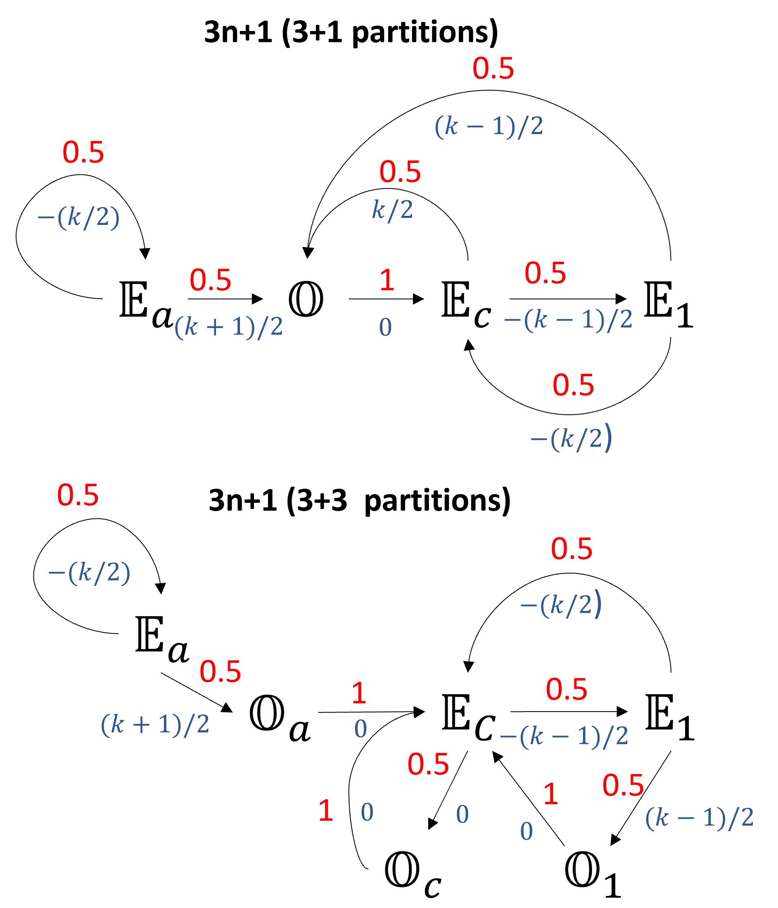
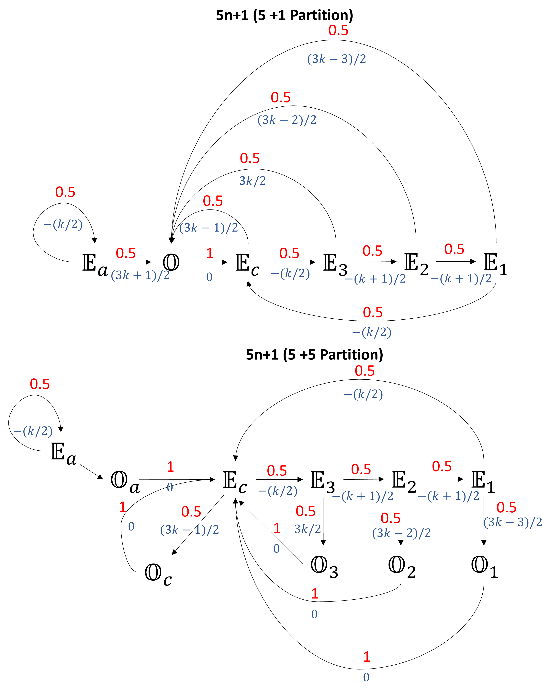

# Visualizing Collatz-Conjecture via Partition

## Problem Statement
From [wiki](https://en.wikipedia.org/wiki/Collatz_conjecture)

Consider the following operation on an arbitrary positive integer:

- If the number is even, divide it by two.
- If the number is odd, triple it and add one.

In modular arithmetic notation, define the function $f$ as follows:

$$
f(n) =
\begin{cases}
n/2 & \textrm{if} \, n \equiv 0 (\textrm{mod 2})\\
3n+1 & \textrm{if}\, n \equiv 1 (\textrm{mod 2})
\end{cases}
$$

Now form a sequence by performing this operation repeatedly, beginning with any positive integer, and taking the result at each step as the input at the next.

In notation:

$$
a_i =
\begin{cases}
n & {\text{for }} i=0, \\
f(a_{i-1}) & {\text{for }} i>0
\end{cases}
$$

(that is: $a_i$ is the value of $f$ applied to $n$ recursively $i$ times; $a_i = f^i(n))$.

The Collatz conjecture is: This process will eventually reach the number 1, regardless of which positive integer is chosen initially. That is, for each $n$, there is some $i$ with $a_i = 1$.

## Some property
1. $U(n):= an+1$ stretches the number line or equivalently $U(n) >n$, for odd $n$
2. $L(n):= n/2$ compresses the number line or equivalently $L(n) <n$ for even $n$
3. The only way to get out is to land on a $2^n\$

## Partitioning 3n+1 (3 even + 1 odd)
Partition $\mathbb{N}$ into four sets as follows:
1. $\mathbb{O} = \\{ o = 2k-1: k \in \mathbb{N} \\}$
2. $\mathbb{E_1} = \\{ 3o-1 = 6k-4: k \in \mathbb{N} \\}$
3. $\mathbb{E_c} = \\{ 3o+1 = 6k-2: k \in \mathbb{N} \\}$
4. $\mathbb{E_a} = \\{ 3o+3 = 6k: k \in \mathbb{N} \\}$

## Partitioning 5n+1 (5 even + 1 odd)
Partition $\mathbb{N}$ into four sets as follows:
1. $\mathbb{O} = \\{ o = 2k-1: k \in \mathbb{N} \\}$
2. $\mathbb{E_1} = \\{ 5o-3 = 10k-8: k \in \mathbb{N} \\}$
3. $\mathbb{E_2} = \\{ 5o-1 = 10k-6: k \in \mathbb{N} \\}$
4. $\mathbb{E_c} = \\{ 5o+1 = 10k-4: k \in \mathbb{N} \\}$
3. $\mathbb{E_3} = \\{ 5o+3 = 10k-2: k \in \mathbb{N} \\}$
4. $\mathbb{E_a} = \\{ 5o+5 = 10k: k \in \mathbb{N} \\}$

This method will span the whole $\mathbb{N}$ and the relation between $k$ and $o$ remains the same for any $an+1$ partitions. As we will see below that this partitioning system helps in comparing the transitions. The subscript $c$ stands for collatz and subscript $a$ is from $an+1$. As you will see these are special partitions. 

Furthermore $\mathbb{O}$ can be partitioned into a partitions based on L(n) operation on $\mathbb E$ however I am not trying attempting index it.

**Every number can be characterized by the number $k$ and the partition.**   
For eg: in $3n+1$, Natural number $12 = (2, \mathbb{E_a})$ and $16 = (3, \mathbb{E_c})$, while in $5n+1$, $12 = (2, \mathbb{E_1})$ and $16 = (2, \mathbb{E_c})$.

## Sub-Partitioning $\mathbb{O}$ for 3n+1 (3 even + 3 odd)
$\mathbb{O}$ = $\\{\mathbb{O_1}, \mathbb{O_a}, \mathbb{O_c}\\}$

## Sub-Partitioning $\mathbb{O}$ for 5n+1 (5 even + 5 odd)
$\mathbb{O}$ = $\\{\mathbb{O_1}, \mathbb{O_c}, \mathbb{O_a}, \mathbb{O_2}, \mathbb{O_3}\\}$

**Thoughts: May be there is another indexing schema that can make this into a proper partitioning?**

## Table with the partition for $3n+1$ and $5n+1$

|	k	|	O:={o=2k-1}	|	$\mathbb{E_1}$={3o-1 = 6k-4}	|	$\mathbb{E_c}$={3o+1 = 6k-2}	|	$\mathbb{E_a}$={3o+3 = 6k}	|		|	k	|	O:={o=2k-1}	|	$\mathbb{E_1}$={5o-3 = 10k-8}	|	$\mathbb{E_2}$={5o-1 = 10k-6}	|	$\mathbb{E_c}$={5o+1 = 10k-4}	|	$\mathbb{E_3}$={5o+3 = 10k-2}	|	$\mathbb{E_a}$={5o+5 = 10k}	|
|	---	|	---	|----|---|---|---|----|----|----|----|----|----|----|
|	1	|	1	|	2	|	4	|	6	|		|	1	|	1	|	2	|	4	|	6	|	8	|	10	|
|	2	|	3	|	8	|	10	|	12	|		|	2	|	3	|	12	|	14	|	16	|	18	|	20	|
|	3	|	5	|	14	|	16	|	18	|		|	3	|	5	|	22	|	24	|	26	|	28	|	30	|
|	4	|	7	|	20	|	22	|	24	|		|	4	|	7	|	32	|	34	|	36	|	38	|	40	|
|	5	|	9	|	26	|	28	|	30	|		|	5	|	9	|	42	|	44	|	46	|	48	|	50	|
|	6	|	11	|	32	|	34	|	36	|		|	6	|	11	|	52	|	54	|	56	|	58	|	60	|
|	7	|	13	|	38	|	40	|	42	|		|	7	|	13	|	62	|	64	|	66	|	68	|	70	|
|	8	|	15	|	44	|	46	|	48	|		|	8	|	15	|	72	|	74	|	76	|	78	|	80	|
|	9	|	17	|	50	|	52	|	54	|		|	9	|	17	|	82	|	84	|	86	|	88	|	90	|
|	10	|	19	|	56	|	58	|	60	|		|	10	|	19	|	92	|	94	|	96	|	98	|	100	|
|	11	|	21	|	62	|	64	|	66	|		|	11	|	21	|	102	|	104	|	106	|	108	|	110	|
|	12	|	23	|	68	|	70	|	72	|		|	12	|	23	|	112	|	114	|	116	|	118	|	120	|
|	13	|	25	|	74	|	76	|	78	|		|	13	|	25	|	122	|	124	|	126	|	128	|	130	|
|	14	|	27	|	80	|	82	|	84	|		|	14	|	27	|	132	|	134	|	136	|	138	|	140	|
|	15	|	29	|	86	|	88	|	90	|		|	15	|	29	|	142	|	144	|	146	|	148	|	150	|

## Table with the subpartition of Odd Set for $3n+1$ and $5n+1$
|	$\mathbb{O_1}$	|	$\mathbb{O_a}$	|	$\mathbb{O_c}$	|		|	$\mathbb{O_1}$	|	$\mathbb{O_c}$	|	$\mathbb{O_a}$	|	$\mathbb{O_2}$	|	$\mathbb{O_3}$	|
|	---	|	---	|---	|---	|---	|---	|---	|---	|---|
|	1	|	3	|	5	|		|	1	|	3	|	5	|	7	|	9	|
|	7	|	9	|	11	|		|	11	|	13	|	15	|	17	|	19	|
|	13	|	15	|	17	|		|	21	|	23	|	25	|	27	|	29	|
|	19	|	21	|	23	|		|	31	|	33	|	35	|	37	|	39	|
|	25	|	27	|	29	|		|	41	|	43	|	45	|	47	|	49	|
|	31	|	33	|	35	|		|	51	|	53	|	55	|	57	|	59	|
|	37	|	39	|	41	|		|	61	|	63	|	65	|	67	|	69	|
|	43	|	45	|	47	|		|	71	|	73	|	75	|	77	|	79	|
|	49	|	51	|	53	|		|	81	|	83	|	85	|	87	|	89	|
|	55	|	57	|	59	|		|	91	|	93	|	95	|	97	|	99	|

## Property of the Partitions for $3n+1$

**1. $U:\mathbb{O} \rightarrow \mathbb{E_c}$ for all $k$** 

**2a. $L:\mathbb{E_1} \rightarrow \mathbb{O_1}$ for odd $k$**   
**2b. $L:\mathbb{E_1} \rightarrow \mathbb{E_c}$ for even $k$**  
 
**3a. $L:\mathbb{E_c} \rightarrow \mathbb{E_1}$ for odd $k$**   
**3b. $L:\mathbb{E_c} \rightarrow \mathbb{O_c}$ for even $k$**  

**4a. $L:\mathbb{E_a} \rightarrow \mathbb{O}$ for odd $k$**   
**4b. $L:\mathbb{E_a} \rightarrow \mathbb{E_a}$ for even $k$**  

## Property of the Partitions for $5n+1$
  
**1. $U:\mathbb{O} \rightarrow \mathbb{E_c}$ for all $k$**

**2a. $L:\mathbb{E_1} \rightarrow \mathbb{O}$ for odd $k$**   
**2b. $L:\mathbb{E_1} \rightarrow \mathbb{E_c}$ for even $k$** 

**3a. $L:\mathbb{E_2} \rightarrow \mathbb{E_0}$ for odd $k$**   
**3b. $L:\mathbb{E_2} \rightarrow \mathbb{O_2}$ for even $k$** 

**4a. $L:\mathbb{E_c} \rightarrow \mathbb{O}$ for odd $k$**   
**4b. $L:\mathbb{E_c} \rightarrow \mathbb{E_3}$ for even $k$** 

**5a. $L:\mathbb{E_3} \rightarrow \mathbb{E_2}$ for odd $k$**   
**5b. $L:\mathbb{E_3} \rightarrow \mathbb{O}$ for even $k$**  

**6a. $L:\mathbb{E_a} \rightarrow \mathbb{O_a}$ for odd $k$**   
**6b. $L:\mathbb{E_a} \rightarrow \mathbb{E_a}$ for even $k$**  

## General Transition Rule
1. In this scheme, Operation $U(n) = an+1$, on $\mathbb{O}$, leaves $k$ unchanged. 
i.e. $\delta K (\mathbb{O} \rightarrow \mathbb{E_c}) = 0$

2. The transition from any Even set to $\mathbb{O}$ increases $k$.

3. The transition from any Even set to another Even set decreases $k$.

### Transition Rule for $3n+1$  
**1. $\Delta k [\mathbb{O} \rightarrow \mathbb{E_c}] = 0$ for all $k$**  
**2a. $\Delta k [\mathbb{E_1} \rightarrow \mathbb{O_1}] = (k-1)/2$ for odd $k$**   
**2b. $\Delta k [\mathbb{E_1} \rightarrow \mathbb{E_c}] = -(k/2)$ for even $k$**  
**3a. $\Delta k [\mathbb{E_c} \rightarrow \mathbb{E_1}] = -(k-1)/2$ for odd $k$**   
**3b. $\Delta k [\mathbb{E_c} \rightarrow \mathbb{O_c}] = (k/2)$ for even $k$**  
**4a. $\Delta k [\mathbb{E_a} \rightarrow \mathbb{O_a}] = (k+1)/2$ for odd $k$**   
**5b. $\Delta k [\mathbb{E_a} \rightarrow \mathbb{E_a}] = -(k/2)$ for even $k$**  
 
### Transition Rule for $5n+1$ 
  
**1. $\Delta k [\mathbb{O} \rightarrow \mathbb{E_c}] = 0$ for all $k$**

**2a. $\Delta k [\mathbb{E_1} \rightarrow \mathbb{O_1}] = (3k-3)/2$ for odd $k$**   
**2b. $\Delta k [\mathbb{E_1} \rightarrow \mathbb{E_c}] = -(k/2)$ for even $k$** 

**3a. $\Delta k [\mathbb{E_2} \rightarrow \mathbb{E_1}] = -(k+1)/2$ for odd $k$**   
**3b. $\Delta k [\mathbb{E_2} \rightarrow \mathbb{O_2}] = (3k-2)/2$ for even $k$**  

**4a. $\Delta k [\mathbb{E_c} \rightarrow \mathbb{O_c}] = (3k-1)/2$ for odd $k$**   
**4b. $\Delta k [\mathbb{E_c} \rightarrow \mathbb{E_3}] = -(k/2)$ for even $k$**  
 
**5a. $\Delta k [\mathbb{E_3} \rightarrow \mathbb{E_2}] = -(k+1)/2$ for odd $k$**   
**5b. $\Delta k [\mathbb{E_3} \rightarrow \mathbb{O_3}] = (3k/2)$ for even $k$**  

**6a. $\Delta k [\mathbb{E_a} \rightarrow \mathbb{O_a}] = (3k+1)/2$ for odd $k$**   
**6b. $\Delta k [\mathbb{E_a} \rightarrow \mathbb{E_a}] = -(k/2)$ for even $k$**  

**Thoughts: Finding $\Delta K$ instead of $L(k)$ or $U(k)$ is overcomplicating an already overcomplicated problem**

## Transition Graph

Probability of transition is given in red and $\Delta k$ is given in blue. Note that $\Delta k$ must be integer.

# Observation
## 1. If there exist a cycle, A cycle will not contain any elements from partitions $\mathbb{E_a}$ and $\mathbb{O_a}$. 
- If you are looking for a cycle, look else where.
## 2a. Only the elements of partitions $\mathbb{E_c}$ can be landed from even and odd number.
## 2b. If there exist a cycle an element from $\mathbb{E_c}$ must participate.
## 2c. Every loop contains element from $\mathbb{E_c}$.

## Example using Transition Rule for $3n+1$

We pick a number (k=100, $\mathbb{E_3}$). The following is its transition.

|	Step	|	k	|	O	|	E1	|	E2	|	E3	|	Parity of k	|	$\Delta k$	|	n	|
|	---	|	---	|---		|	---	|	---	|---		|---		|---		|---		|
|	1	|	100	|		|		|		|	X	|	even	|	$-(k/2)$	|	600	|
|	2	|	50	|		|		|		|	X	|	even	|	$-(k/2)$	|	300	|
|	3	|	25	|		|		|		|	X	|	odd	|	$(k+1)/2$	|	150	|
|	4	|	38	|	X	|		|		|		|	Doesn’t matter	|	0	|	75	|
|	5	|	38	|		|		|	X	|		|	Even	|	$k/2$	|	226	|
|	6	|	57	|	X	|		|		|		|	Doesn’t matter	|	0	|	113	|
|	7	|	57	|		|		|	X	|		|	odd	|	$(-k-1)/2$	|	340	|
|	8	|	29	|		|	X	|		|		|	odd	|	$(k-1)/2$	|	170	|
|	9	|	43	|	X	|		|		|		|	Doesn’t matter	|	0	|	85	|
|	10	|	43	|		|		|	X	|		|	odd	|	$(-k-1)/2$	|	256	|
|	11	|	22	|		|	X	|		|		|	even	|	$-(k/2)$	|	128	|
|	12	|	11	|		|		|	X	|		|	odd	|	$(-k-1)/2$	|	64	|
|	13	|	6	|		|	X	|		|		|	even	|	$-(k/2)$	|	32	|
|	14	|	3	|		|		|	X	|		|	odd	|	$(-k-1)/2$	|	16	|
|	15	|	2	|		|	X	|		|		|	even	|	$-(k/2)$	|	8	|
|	16	|	1	|		|		|	X	|		|	odd	|	$(-k-1)/2$	|	4	|
|	17	|	1	|		|	X	|		|		|	odd	|	$(k-1)/2$	|	2	|
|	18	|	1	|	X	|		|		|		|		|		|	1	|

## Appendix

## Property of the Partitions for 3n+1

**Theorem 1**  
**$U:\mathbb{O} \rightarrow \mathbb{E_2}$ for all $k$** (By construction)

**Theorem 2**  
 a. **$L:\mathbb{E_3} \rightarrow \mathbb{O}$ for odd $k$**   
 b. **$L:\mathbb{E_3} \rightarrow \mathbb{E_3}$ for even $k$**  

Proof: $L(6k) = 3k$ 

2a. for odd $k$, $k = 2m-1$ for $m \in \mathbb{N}$.  
This means, $L(6k) = 6m-3 = 3(2m-1) \in \mathbb{O}$.  

2b. for even $k$, $k = 2m$ for $m \in \mathbb{N}$.  
This means, $L(6k) = 6m \in \mathbb{E_3}$.

**Theorem 3**  
 a. **$L:\mathbb{E_2} \rightarrow \mathbb{E_1}$ for odd $k$**   
 b. **$L:\mathbb{E_2} \rightarrow \mathbb{O}$ for even $k$**  

Follow the procedure of Theorem 2.

**Theorem 4**  
 a. **$L:\mathbb{E_1} \rightarrow \mathbb{O}$ for odd $k$**   
 b. **$L:\mathbb{E_1} \rightarrow \mathbb{E_2}$ for even $k$**  

Follow the procedure of Theorem 2.

**Not sure the relevance of Therem 5 to 7, but something I noticed.**

**Theorem 5**   
 **$2^m \notin \mathbb{E_3}$ for all $m \in \mathbb{N}$**  
Proof: By Contradiction.

let, 
$2^m = 6k$  
$2(2^{n-1} )= 2 \times 3k$  
$k=2^{n-1}/3$  
Then 3 divides $2^{n-1}$.   
But $2^{n-1}$ is a product of only the prime number 2, so it's only prime divisor is 2.   
Contradition.  

**Theorem 6**  
**All $2^p$ for even $p$ lives in $\mathbb{E_2}$.**  
i.e. $\\{2^p: p \, \text{even}\\} \subset \\{6k-2): k \in \mathbb{N}\\}$

Proof:
$p=2m, m\in \mathbb{N}$  
Then, $2^p = 2^{2m}$  
Since, $2^2 \equiv 1$ (mod 3)  
$2^{2m} \equiv 1^m = 1$ (mod 3)  
Therefore, $2^{2m-1} \equiv 2 \equiv -1$  

So there exists $k\in \mathbb{N}$, such that,  
$2^{2m-1} = 3k-1$.  
or, $2^{2m} = 2(3k-1)$.

Hence, $2^p = 6k-2$.  

**Theorem 7**  
**All $2^p$ for odd $p$ lives in $\mathbb{E_1}$.**  
i.e. $\\{2^p: p \, \text{odd} \\} \subset \\{6k-4): k \in \mathbb{N}\\}$

Proof:
$p=2m+1, m \in \mathbb{N} \cup \\{0\\} \$  
Then, $2^p = 2^{2m+1}$  
Since, $2^2 \equiv 1$ (mod 3)  
$2^{2m} \equiv 1$ (mod 3)  
Therefore, $2^{2m} \equiv 3k-2$  

So there exists $k\in \mathbb{N}$, such that,  
$2^{2m+1} = 2(3k-2)$.  

Hence, $2^p = 6k-4$.  

**Note that $2^p$ for odd $p$ can be landed from only $2^p$ for even $p$.** 

**For 5n+1, the observation about $2^p$ seems to be consistent with $3n+1$ but with added complexity. Eg: $2^n$ is missing from $E_4$.**

## Intuition
1. Considering the whole set of Natural Number ($\mathbb{N}$) felt more appropriate than studying the sequence itself. May be because this process is probabilistic (in some sense, eg: some number can be generated by both n/2 and 3n+1 process, while others cant)
2. I started by dividing the Natural Numbers in Even set ($\mathbb{E}$) and Odd set ($\mathbb{O}$) and then thought about the effect of two operation on the size of the set. For instance,
 - $n/2$ maps $\mathbb{E}$ to $\mathbb{E}$ and $\mathbb{O}$ and while doing so compresses the number line.
 - $3n+1$ takes $\mathbb{O}$ and maps it to only $\mathbb{E}$ and while doing so stretches the number line.
3. I realized that due to Cantor, we can't talk about the size of the sets, or effect on the size of the set (they wont change), but number density is still a fair game.
4. So, I decided to partition the $\mathbb{E}$ into 3 non-intersecting set using 3n+1 rule.
5. Applying this process on 5n+1 operation helps to see why they can diverge and lead to circular loop.
